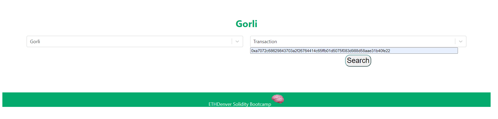
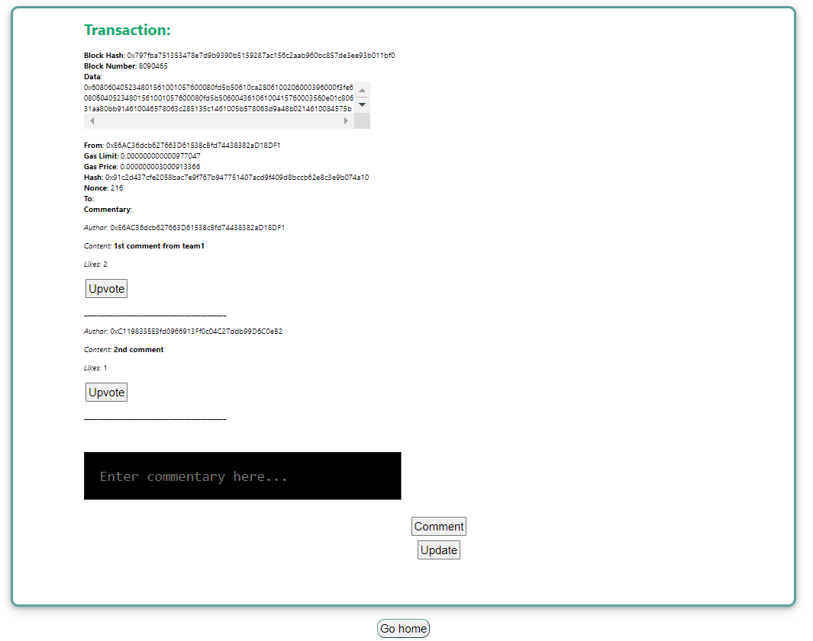

# Project Info

This repo displays the final project "Social Media Block Explorer" developed by Project Group 1 for ETHDenver Solidity Bootcamp 2022.

## Social Media Block Explorer

Inspired during the bootcamp when instructor given students task to explore transaction hash on etherscan. We started to wonder what if the block explorer actually contains the walkthrough of whats happening?

<br/>
Having an idea in mind, we set out to build a block explorer that able to let users propose comments on the walkthrough of what's happening on a transaction. Other participants also able to participate by giving any comments that they deemed useful an 'upvote'. Through this, we able to filter out good comments and build a simulation of community where there is proposer & members...sorta like a DAO! (Maybe an idea to build on top of this project? 😜)

## Project Setup

To install required dependencies:

```
npm install / yarn install
```

Insert your respective Mainnet & Goerli HTTP API URL in [this](./explorer/src/utils/config.json) file by replacing `REACT_APP_MAINNET_URL` and `REACT_APP_GOERLI_URL` respectively.

To start the project locally:

```
npm start / yarn start
```

# Project Demo

<figure><figcaption align = "center"><b>Fig.1 - Home Page of Social Media Block Explorer</b></figcaption></figure>

<figure><figcaption align = "center"><b>Fig.1 - Transaction page showing comments and upvote</b></figcaption></figure>
